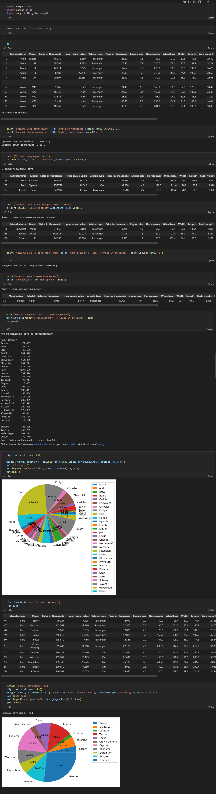

МИНИСТЕРСТВО НАУКИ И ВЫСШЕГО ОБРАЗОВАНИЯ
РОССИЙСКОЙ ФЕДЕРАЦИИ
ФЕДЕРАЛЬНОЕ ГОСУДАРСТВЕННОЕ БЮДЖЕТНОЕ
ОБРАЗОВАТЕЛЬНОЕ УЧРЕЖДЕНИЕ ВЫСШЕГО ОБРАЗОВАНИЯ
«САХАЛИНСКИЙ ГОСУДАРСТВЕННЫЙ УНИВЕРСИТЕТ»

      

Институт естественных наук и техносферной безопасности Кафедра информатики Чагочкин Никита

   

Обработка данных Python 01.03.02 Прикладная математика и информатика

            

Научный руководитель 
Лоскутов Артём Владимирович

   

г. Южно-Сахалинск 2023 г.

***
# 
Задача 

Найти любой источник данных в интернете, загрузить с помощью pandas, посчитать основные статистики, построить произвольные графики в matplotlib. 
# 
Решение

В качестве данных я выбрал информацию по продажам автомобилей
